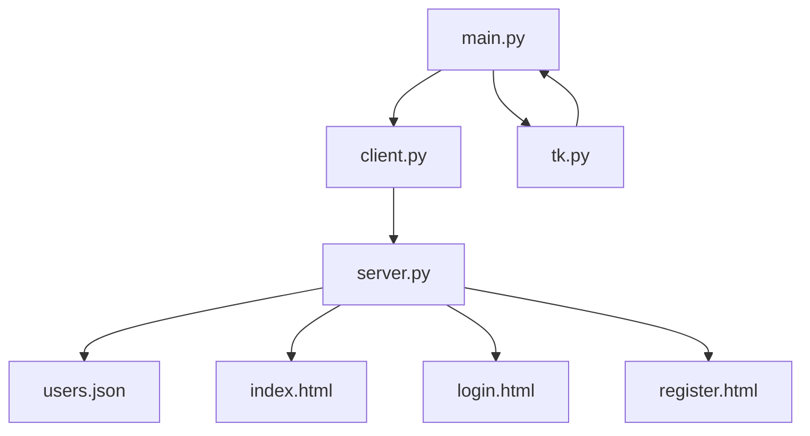

# Slots-Spiel-Client
### Übersicht
Diese Anwendung bietet eine grafische Benutzeroberfläche für ein Spielautomaten-Spiel. Benutzer können sich registrieren, anmelden, die Bestenliste ansehen, das Spiel spielen und ihren Kontostand überprüfen. Der Client interagiert mit einem Backend-Service, um diese Operationen durchzuführen.
### Funktionen
- **Benutzerauthentifizierung**: Registrieren und Anmelden in der Anwendung.
- **Bestenliste**: Anzeigen der Top-Spieler, sortiert nach ihren Gewinnen.
- **Spielablauf**: Benutzer können Einsätze platzieren und Runden am Spielautomaten spielen.
- **Kontostandsverwaltung**: Anzeigen und Verwalten des Benutzerkontostands.
### Voraussetzungen
- **Python** 3.7 oder höher
- **Tkinter** für Python

# Slot-Spiel-Anwendung

Diese Webanwendung ermöglicht es Benutzern, sich zu registrieren, anzumelden und ein einfaches Slot-Spiel zu spielen. Sie nutzt Flask für das Backend und bietet eine interaktive Benutzeroberfläche mit Tkinter für das Frontend.

## Funktionen

- **Benutzerregistrierung und -anmeldung:** Benutzer können ein Konto erstellen und sich anmelden. Diese Aktionen werden über das Backend mit einer REST API abgewickelt.
- **Slot-Spiel:** Nach der Anmeldung können Benutzer Einsätze platzieren und das Spiel über eine Tkinter-Oberfläche spielen.
- **Leaderboard:** Die Anwendung zeigt ein Leaderboard an, das die Benutzer mit dem meisten Geld auflistet.

## Technologien

- **Flask:** Ein Mikro-Webframework für Python, das verwendet wird, um das Backend zu handhaben.
- **Tkinter:** Ein Standard-GUI-Toolkit für Python, das für die Entwicklung der Frontend-Oberfläche verwendet wird.
- **Requests:** Eine Bibliothek zur Handhabung von HTTP-Anfragen, um mit dem Backend zu kommunizieren.

# Softwarearchitektur 

